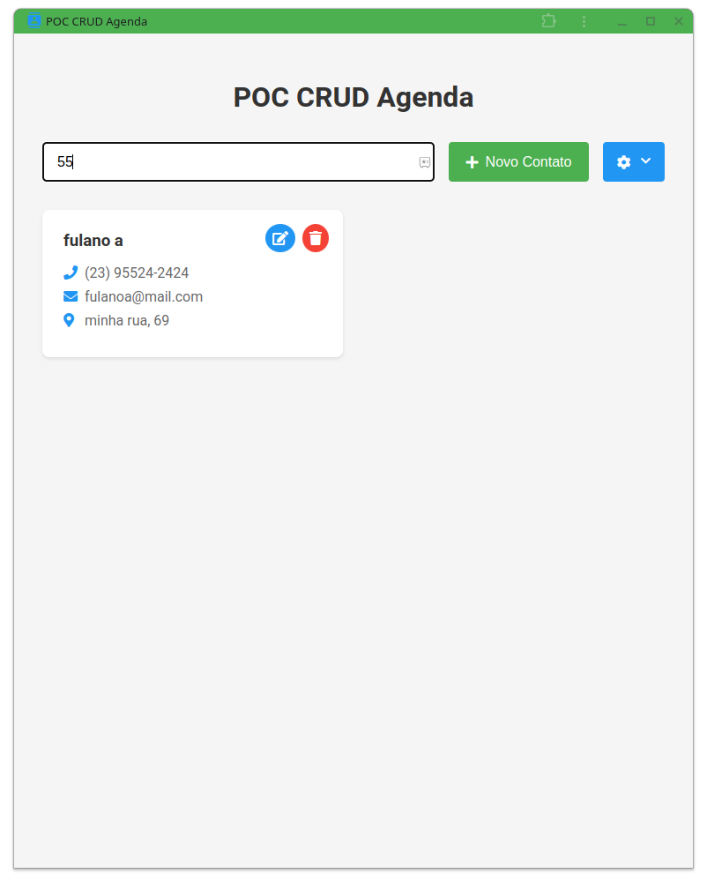

# POC CRUD Agenda

<div align="center">
  
</div>

Uma aplicação web progressiva (PWA) para gerenciamento de contatos desenvolvida com SvelteKit.

## Screenshots

<div align="center">
  <h3>Tela Principal</h3>
  <p><em>Grid de contatos com busca e menu de configurações</em></p>
  
  
  

  <h3>Filtro de Busca</h3>
  <p><em>Filtro de busca em tempo real</em></p>
  
  
  <h3>Menu de Configurações</h3>
  <p><em>Opções de importação, exportação e instalação do app</em></p>
  

  <h3>CREATE</h3>
  <p><em>Adição de contatos com validações em tempo real</em></p>
  

  <h3>UPDATE</h3>
  <p><em>Edição de contatos existentes com validações em tempo real</em></p>
  

  <h3>DELETE</h3>
  <p><em>Exclusão de contatos com confirmação em modal</em></p>
  
</div>

## Funcionalidades

### CRUD de Contatos
- **Create**: Adição de novos contatos com validações em tempo real
- **Read**: Visualização em grid de cards responsivo
- **Update**: Edição de contatos existentes
- **Delete**: Exclusão com confirmação em modal

### Campos do Contato
- **Nome**: Obrigatório, mínimo 3 caracteres
- **Telefone**: Formatação automática para:
  - Celular: (99) 99999-9999
  - Fixo: (99) 9999-9999
- **Email**: Validação de formato
- **Endereço**: Campo opcional

### Persistência de Dados
- Utilização do IndexedDB para armazenamento local
- Dados mantidos mesmo após recarregar a página
- Gerenciamento assíncrono eficiente

### Importação/Exportação
- Exportação de contatos para CSV (separador: ;)
- Importação de contatos via CSV
- Preservação dos dados durante importação

### Interface
- Design responsivo
- Grid de cards com animações
- Modais para formulários
- Menu de configurações
- Filtro de busca em tempo real
- Feedback visual de validações

### PWA (Progressive Web App)
- Instalável como aplicativo
- Funciona offline
- Ícones personalizados
- Tema consistente

#### Como Instalar
1. Abra o menu de configurações (ícone de engrenagem)
2. Clique em "Instalar Aplicativo"
3. Confirme a instalação

#### Como Desinstalar
**No Chrome/Edge:**
1. Clique nos três pontos (⋮) no canto superior direito
2. Vá em "Apps"
3. Encontre "POC CRUD Agenda"
4. Clique nos três pontos ao lado do app
5. Selecione "Remover da Chrome"
6. Confirme a desinstalação

**No Android:**
1. Encontre o ícone do app na tela inicial ou gaveta de apps
2. Pressione e segure o ícone
3. Arraste para "Desinstalar" ou selecione a opção "Desinstalar"
4. Confirme a desinstalação

**No Windows:**
1. Vá em Configurações > Apps
2. Encontre "POC CRUD Agenda"
3. Clique em "Desinstalar"
4. Confirme a desinstalação

## Tecnologias Utilizadas
- SvelteKit
- IndexedDB
- Service Workers
- Vite
- CSS Moderno (Grid/Flexbox)

## Como Executar

1. Clone o repositório
2. Instale as dependências:
```bash
npm install
```

3. Execute em desenvolvimento:
```bash
npm run dev
```

4. Para build de produção:
```bash
npm run build
npm run preview
```

## Estrutura do Projeto
```
src/
├── lib/
│   ├── components/
│   │   ├── ContatoForm.svelte
│   │   └── ConfirmacaoModal.svelte
│   └── services/
│       └── db.js
└── routes/
    ├── +layout.js
    ├── +layout.svelte
    └── +page.svelte
```

## Validações
- **Nome**: Mínimo 3 caracteres
- **Telefone**: 
  - Celular: (99) 99999-9999 (11 dígitos)
  - Fixo: (99) 9999-9999 (10 dígitos)
  - Formatação automática
  - Validação do primeiro dígito após DDD
- **Email**: Formato válido de email

## Recursos Adicionais
- Busca por nome, email ou telefone
- Animações suaves
- Interface responsiva
- Instalação como PWA
- Persistência local dos dados

## Limitações
- Armazenamento local (não há backend)
- Dados limitados ao navegador atual
